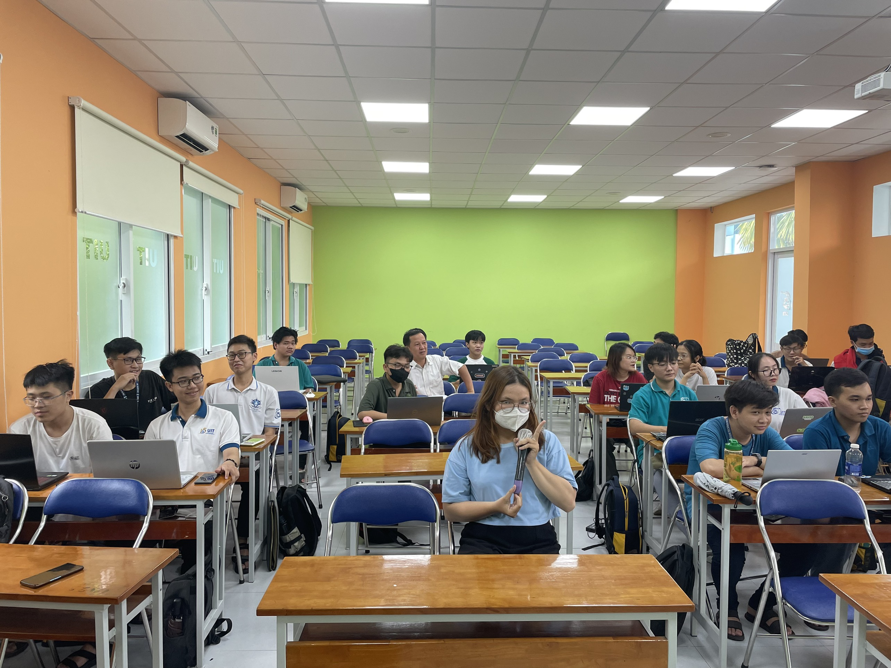
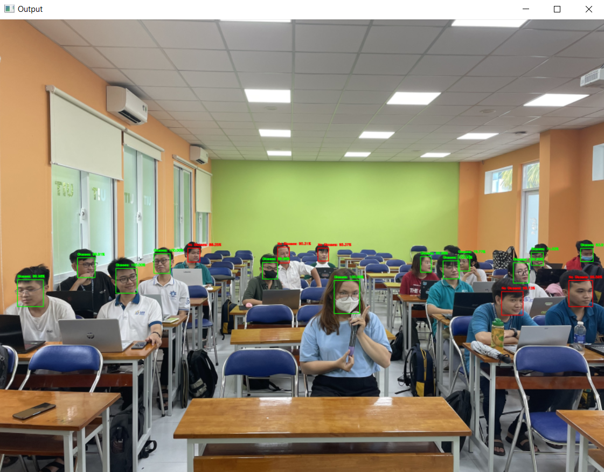

## OVERVIEW
This repository contains the source code for an eyeglasses detection system developed as part of the CS231 Computer Vision course. The project focuses on implementing algorithms and techniques for detecting eyeglasses in images.
Time of project: 2022


### DEMO
Input                           | Output
:-------------------------:|:-------------------------:
|

Installation
---------------
```
git clone https://github.com/lltlien/eyeglasses-detection.git
cd eyeglasses-detection
```

Dependencies
---------------
```
deepface==0.0.68
opencv-python==4.5.5.62
numpy==1.24.3
imutils==0.5.4
tensorflow==2.0.1
scikit-learn==0.24.1
matplotlib==3.5.1
```

Training
---------------
- To train the eyeglasses detection model using MobileNetV2.
 ```
python train_mobilenetv2_model.py
```
- To train the eyeglasses detection model using ResNet101V2.
```
python train_resnetv2.py
```
- Save trained model to predict.

Prediction
---------------
To detect all faces in an image and then predict eyeglasses using the trained models.
```
python image_prediction_using_deep_face.py
```
